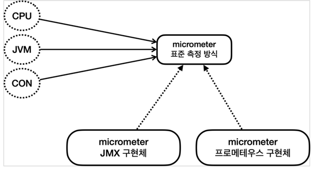
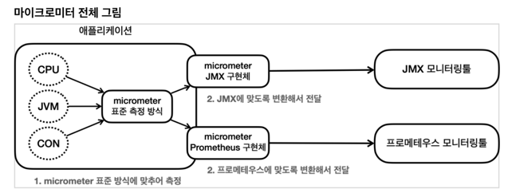

# Micrometer
- Application Metric Facade
- [Micrometer 공식 문서](https://micrometer.io/docs)





# Spring Actuator + Micrometer
- Spring Actuator는 `@AutoConfiguration`을 통해 Micrometer가 제공하는 지표 수집을 자동으로 설정한다.

## metrics Endpoint
- `GET /actuator/metrics` : 모든 metric 조회
- `GET /actuator/metrics/{metric-name}` : 특정 metric 조회
- `GET /actuator/metrics/{metric-name}?tag={tag-name}:{tag-value}` : 특정 metric 조회 (tag 필터)

```http request
GET /actuator/metrics

HTTP/1.1 200 OK
{
  "names": [
    "application.ready.time",
    "application.started.time",
    "disk.free",
    "disk.total",
    "executor.active",
    "executor.completed",
    "executor.pool.core",
    "executor.pool.max",
    "executor.pool.size",
    "executor.queue.remaining",
    "executor.queued",
    "hikaricp.connections",
    "hikaricp.connections.acquire",
    "hikaricp.connections.active",
    "hikaricp.connections.creation",
    "hikaricp.connections.idle",
    "hikaricp.connections.max",
    "hikaricp.connections.min",
    "hikaricp.connections.pending",
    "hikaricp.connections.timeout",
    "hikaricp.connections.usage",
    "http.server.requests",
    "http.server.requests.active",
    "jdbc.connections.active",
    "jdbc.connections.idle",
    "jdbc.connections.max",
    "jdbc.connections.min",
    "jvm.buffer.count",
    "jvm.buffer.memory.used",
    "jvm.buffer.total.capacity",
    "jvm.classes.loaded",
    "jvm.classes.unloaded",
    "jvm.compilation.time",
    "jvm.gc.live.data.size",
    "jvm.gc.max.data.size",
    "jvm.gc.memory.allocated",
    "jvm.gc.memory.promoted",
    "jvm.gc.overhead",
    "jvm.info",
    "jvm.memory.committed",
    "jvm.memory.max",
    "jvm.memory.usage.after.gc",
    "jvm.memory.used",
    "jvm.threads.daemon",
    "jvm.threads.live",
    "jvm.threads.peak",
    "jvm.threads.states",
    "logback.events",
    "process.cpu.usage",
    "process.files.max",
    "process.files.open",
    "process.start.time",
    "process.uptime",
    "system.cpu.count",
    "system.cpu.usage",
    "system.load.average.1m",
    "tomcat.sessions.active.current",
    "tomcat.sessions.active.max",
    "tomcat.sessions.alive.max",
    "tomcat.sessions.created",
    "tomcat.sessions.expired",
    "tomcat.sessions.rejected"
  ]
}
```

```http request
GET /actuator/metrics/jvm.memory.max

HTTP/1.1 200 OK
{
  "name": "jvm.memory.used",
  "description": "The amount of used memory",
  "baseUnit": "bytes",
  "measurements": [
    {
      "statistic": "VALUE",
      "value": 1.445272E8
    }
  ],
  "availableTags": [
    {
      "tag": "area",
      "values": [
        "heap",
        "nonheap"
      ]
    },
    {
      "tag": "id",
      "values": [
        "G1 Survivor Space",
        "Compressed Class Space",
        "Metaspace",
        "CodeCache",
        "G1 Old Gen",
        "G1 Eden Space"
      ]
    }
  ]
}
```

### Tag 필터
- `tag={tag-name}:{tag-value}`

```http request
GET /actuator/metrics/jvm.memory.used?tag=area:heap

HTTP/1.1 200 OK
{
  "name": "jvm.memory.used",
  "description": "The amount of used memory",
  "baseUnit": "bytes",
  "measurements": [
    {
      "statistic": "VALUE",
      "value": 7.2682856E7
    }
  ],
  "availableTags": [
    {
      "tag": "id",
      "values": [
        "G1 Survivor Space",
        "G1 Old Gen",
        "G1 Eden Space"
      ]
    }
  ]
}
```

## Spring Actuator가 지원하는 다양한 메트릭
> [Supported Metrics and Meters - Spring 공식 메뉴얼](https://docs.spring.io/spring-boot/docs/current/reference/html/actuator.html#actuator.metrics.supported)

- JVM Metrics
- System Metrics
- Application Startup Metrics
- Spring MVC Metrics
- Tomcat Metrics
- DataSource Metrics
- Logger Metrics
- ...

### JVM Metrics
> `jvm.` 으로 시작한다.

- 메모리 및 버퍼 풀 세부 정보
- Garbage Collection 관련 통계
- Thread 활용
- 로드 및 언로드된 Class 수
- JVM 버전 정보
- JIT 컴파일 시간

### System Metrics
> `system.`, `process.`, `disk.` 으로 시작한다.

- CPU 관련 메트릭
- File Descriptor 관련 메트릭
- 가동 시간 관련 메트릭
- 사용 가능한 디스크 공간

### Application Startup Metrics
- `application.started.time` : Application 시작하는데 걸리는 시간
  - `ApplicationStartedEvent` 을 통해서 측정한다.
- `application.ready.time` : Application이 요청을 처리할 준비가 되는데 걸리는 시간
  - `ApplicationReadyEvent` 을 통해서 측정한다.


- Spring은 내부에 여러 초기화 단계가 있다.
  - 각 단계별로 내부에서 ApplicationEvent를 발행한다.
- `ApplicationStartedEvent` : Spring Container가 완전히 실행된 상태. 이후에 `CommandLineRunner`가 실행된다.
- `ApplicationReadyEvent` : `CommandLineRunner`가 실행된 이후에 발행한다.

### Spring MVC Metrics
- `http.server.requests` : HTTP 요청에 대한 지표
- `ServerRequestObservationConvention` 구현체를 통해 제공한다.
  - `DefaultServerRequestObservationConvention`

| Tag       | Description                                                                                                          |
|-----------|----------------------------------------------------------------------------------------------------------------------|
| exception | The simple class name of any exception that was thrown while handling the request.                                   |
| method    | The request’s method (for example, GET or POST)                                                                      |
| outcome   | The request’s outcome, based on the status code of the response. 1xx is INFORMATIONAL, 2xx is SUCCESS, 3xx is REDIRECTION, 4xx is CLIENT_ERROR, and 5xx is SERVER_ERROR |
| status    | The response’s HTTP status code (for example, 200 or 500)                                                            |
| uri       | The request’s URI template prior to variable substitution, if possible (for example, /api/person/{id})                |

### DataSource Metrics
- `jdbc.connections.*` : JDBC Connection Pool 관련 지표

### Logger Metrics
- `logback.events` : Logback 관련 지표
  - `tag=level:trace`
  - `trace`, `debug`, `info`, `warn`, `error` 로그 레벨별로 지표를 제공한다.

### Tomcat Metrics
- `tomcat.` 으로 시작한다.
- Tomcat 메트릭을 모두 사용하려면 `server.tomcat.mbeanregistry.enabled` 설정이 필요하다.
  - 옵션을 켜지 않으면, 기본적으로 제공하는 `tomcat.sessions.*` 관련 정보만 제공한다.

```yaml
server:
  tomcat:
    mbeanregistry:
      enabled: true
```

### 기타 Metrics
- HTTP Client Metrics (`RestTemplate`, `WebClient`)
- Cache Metrics
- Spring Batch Metrics
- Spring GraphQL Metrics
- Spring Data Repository Metrics
- RabbitMQ Metrics
- Kafka Metrics
- MongoDB Metrics
- Redis Metrics
- Spring WebFlux Metrics
