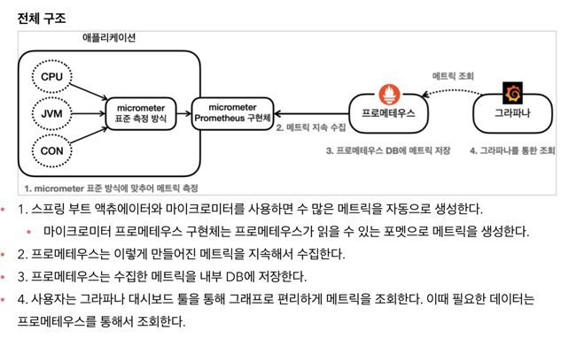
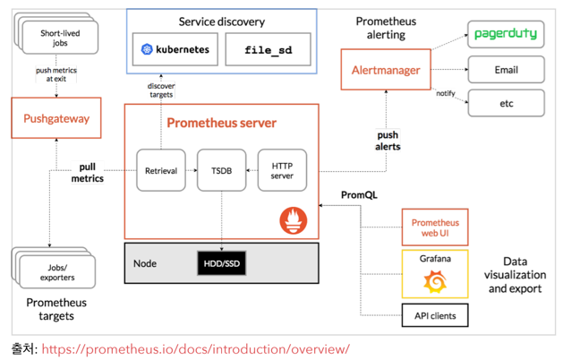
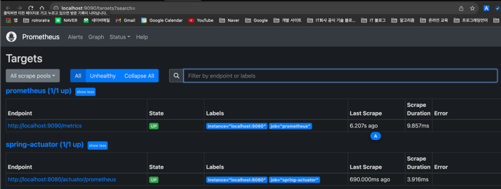
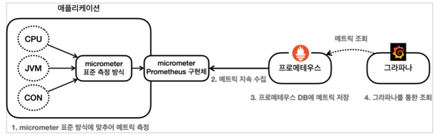

# Prometheus




## Prometheus  Applicaiton 설정
1. Application 설정
2. Prometheus 설정

### 1. Application 설정
- Prometheus가 Application의 Metric을 가져갈수 있도록, Application에서 Prometheus Metric 포맷에 맞추어 Metric을 제공해야한다.
- `io.micrometer:micrometer-registry-prometheus` 의존성을 추가하면, Spring Boot Actuator가 제공하는 Metric을 Prometheus Metric 포맷으로 제공한다.
  - `/actuator/promethues` Endpoint가 자동으로 추가된다.

```groovy
dependencies {
    implementation 'io.micrometer:micrometer-registry-prometheus'
}
```

### Prometheus 정상 작동 확인


### 2. Prometheus 설정
- Prometheus가 Application의 Metric을 가져갈수 있도록, Prometheus 설정에 Application을 등록해야한다.
- `prometheus.yml` 설정 파일에 Application을 등록한다.

```yaml
# 추가
scrape_configs:
  - job_name: "spring-actuator"
    metrics_path: '/actuator/prometheus'
    scrape_interval: 1m
    static_configs:
    - targets:
      - 'localhost:8080'
```

## Prometheus 기본 기능
- [Prometheus Querying Basic - Prometheus 공식 메뉴얼](https://prometheus.io/docs/prometheus/latest/querying/basics/)

- [Prometheus Querying Operators - Prometheus 공식 메뉴얼](https://prometheus.io/docs/prometheus/latest/querying/operators/)

- [Prometheus Querying Functions - Prometheus 공식 메뉴얼](https://prometheus.io/docs/prometheus/latest/querying/functions/)
### Filter
> label 기준으로 필터를 사용할 수 있다.

- `=` : label 값이 일치하는 경우
- `!=` : label 값이 일치하지 않는 경우
- `=~` : label 값이 정규식과 일치하는 경우
- `!~` : label 값이 정규식과 일치하지 않는 경우

#### Filter 예시
- `http_server_requests_seconds_count{uri="/actuator/prometheus"}`
- `http_server_requests_seconds_count{uri!="/actuator/prometheus", status="200"}`
- `http_server_requests_seconds_count{method=~"GET|POST"}`
- `http_server_requests_seconds_count{uri!~"/actuator.*"}`

### 연산자
- 아래와 같은 연산자를 지원한다.
  - `+`
  - `-`
  - `*`
  - `/`
  - `%`
  - `^`

### sum()
- 값의 합계를 구한다.
  - `sum(http_server_requests_seconds_count{outcome="SUCCESS"})`

### sum by()()
- SQL의 group by 기능과 유사하다.
  - `sum by (method, status) (http_server_requests_seconds_count)`

### count()
- Metric 자체의 수를 구한다.
  - `count(http_server_requests_seconds_count)`

### topk(k, ...)
- 상위 3개 Metric 조회
  - `topk(3, http_server_requests_seconds_count)`

### offset
- 현재를 기준으로 특정 과거 시점의 데이터를 반환한다.
  - `http_server_requests_seconds_count offset 5m`

### 범위 벡터 선택기 ([...])
- 지난 5분 동안의 데이터를 조회한다.
  - `http_server_requests_seconds_count[5m]`
- 범위 벡터 선택기는 차트에 바로 표현할 수 없다.
  - 데이터로는 확인할 수 있다.
  - increase, rate, irate 함수를 사용하면 차트로 표현할 수 있다.

### 게이지 (Gauge)
- 임의로 오르내릴 수 있는 값
- 예) 현재 메모리 사용량, 현재 스레드 개수, 현재 사용중인 Connection 개수 등

### 카운터 (Counter)
- 단순하게 증가하는 단일 누적 값
- 예) HTTP 요청 수, 로그 발생 수, 에러 발생 수 등

### increase()
- 지정한 시간 단위별로 증가를 확인할 수 있다.
- 파라미터로 범위 벡터를 넘겨줘야한다.
  - `increase(http_server_requests_seconds_count{uri="/actuator/prometheus"}[1m])`

### rate()
- 범위 벡터에서 초당 평균 증가율을 계산한다.
  - `rate(http_server_requests_seconds_count{uri="/actuator/prometheus"}[1m])`
- **초당 얼마나 증가하는지 나타내는 지표라고 보면 된다.**

### irate()
- `rate` 함수와 유사
- 범위 벡터에서 초당 순간 증가율을 계산한다.
- 급격하게 증가한 내용을 확인하는데 좋다.
  - `irate(http_server_requests_seconds_count{uri="/actuator/prometheus"}[1m])`

# Grafana


## Grafana 공유 대시보드
[Grafana DashBoards](https://grafana.com/grafana/dashboards/)

## Grafana SpringBoot 관련 대시보드 예시
- [Spring Boot 2.1 System Monitor](https://grafana.com/grafana/dashboards/11378-justai-system-monitor/)
  - 설정 json에서 `jetty_` 를 `tomcat_` 으로 변경해야한다.
  - `jetty_threads_idle` 제거
  - `jetty_threads_jobs` 제거

- [JVM (Micrometer)](https://grafana.com/grafana/dashboards/4701)

# Custom Metric 추가

[Counter - Prometheus 공식 메뉴얼](https://prometheus.io/docs/concepts/metric_types/#counter)

## Counter, MeterRegistry 
- `MeterRegistry` 는 자동으로 Bean으로 등록되어 있다.
- `io.micrometer.core.instrument.Counter` 를 사용한다.

```java

```java
@RequiredArgsConstructor
public class OrderServiceV1 implements OrderService {
    
    private final MeterRegistry meterRegistry;

    // ...
  
    @Override
    public void order() {
        log.info("OrderServiceV0.order");
        stock.decrementAndGet();

        Counter.builder("my.order")
            .tag("class", this.getClass().getName())
            .tag("method", "order")
            .description("order")
            .register(meterRegistry).increment();
    }

    @Override
    public void cancel() {
        log.info("OrderServiceV0.cancel");
        stock.incrementAndGet();

        Counter.builder("my.order")
            .tag("class", this.getClass().getName())
            .tag("method", "cancel")
            .description("order")
            .register(meterRegistry).increment();
    }
    
    // ...
}
```

- `MeterRegistry`를 주입받아서 사용한다.

## @Counted, CountedAspect
- `CountedAspect` Bean으로 등록해야 한다.
- `CountedAspect`를 이용해서 AOP를 적용한다.

```java
public class OrderServiceV2 implements OrderService {
    // ...
  
    @Counted("my.order")
    @Override
    public void order() {
        log.info("OrderServiceV0.order");
        stock.decrementAndGet();
    }

    @Counted("my.order")
    @Override
    public void cancel() {
        log.info("OrderServiceV0.cancel");
        stock.incrementAndGet();
    }
    
    //...
}
```

## Timer, MeterRegistry
- `io.micrometer.core.instrument.Timer` 를 사용한다.
- `MeterRegistry`는 자동으로 Bean으로 등록되어 있다.

```java
@RequiredArgsConstructor
public class OrderServiceV1 implements OrderService {

    private final MeterRegistry meterRegistry;

    // ...
    @Override
    public void order() {
        Timer timer = Timer.builder("my.order")
            .tag("class", this.getClass().getName())
            .tag("method", "order")
            .description("order")
            .register(meterRegistry);

        timer.record(() -> {
            log.info("OrderServiceV3.order");
            stock.decrementAndGet();
            sleep(500);
        });
    }

    @Override
    public void cancel() {
        Timer timer = Timer.builder("my.order")
            .tag("class", this.getClass().getName())
            .tag("method", "cancel")
            .description("order")
            .register(meterRegistry);

        timer.record(() -> {
            log.info("OrderServiceV3.cancel");
            stock.incrementAndGet();
            sleep(200);
        });
    }

    //...
}
```

### Spring Actuator Metric 확인
- `measurementes` 항목을 보면 총 2가지 측정 항목이 추가되었다.
  - `COUNT` : 호출 횟수
  - `TOTAL_TIME` : 총 소요 시간
  - `MAX` : 최대 소요 시간
```http request
GET http://localhost:8080/actuator/metrics/my.order
```

```json
{
  "name": "my.order",
  "description": "order",
  "baseUnit": "seconds",
  "measurements": [
    {
      "statistic": "COUNT",
      "value": 11.0
    },
    {
      "statistic": "TOTAL_TIME",
      "value": 4.801505126
    },
    {
      "statistic": "MAX",
      "value": 0.0
    }
  ],
  "availableTags": [
    {
      "tag": "method",
      "values": [
        "cancel",
        "order"
      ]
    },
    {
      "tag": "class",
      "values": [
        "hello.order.v3.OrderServiceV3"
      ]
    }
  ]
}
```

### Prometheus Metric 포맷 확인 
- 다음 접두사가 붙으면서 3가지 메트릭을 제공한다.
  - `seconds_count` : 누적 실행 수
  - `seconds_sum` : 총 소요 시간
  - `seconds_max` : 최대 소요 시간
- `seconds_sum / seconds_count` : 평균 실행시간

```http request
GET http://localhost:8080/actuator/prometheus
```

```text
# ...
# HELP my_order_seconds order
# TYPE my_order_seconds summary
my_order_seconds_count{class="hello.order.v3.OrderServiceV3",method="order",} 5.0
my_order_seconds_sum{class="hello.order.v3.OrderServiceV3",method="order",} 2.915286917
my_order_seconds_count{class="hello.order.v3.OrderServiceV3",method="cancel",} 6.0
my_order_seconds_sum{class="hello.order.v3.OrderServiceV3",method="cancel",} 1.886218209
# HELP my_order_seconds_max order
# TYPE my_order_seconds_max gauge
my_order_seconds_max{class="hello.order.v3.OrderServiceV3",method="order",} 0.0
my_order_seconds_max{class="hello.order.v3.OrderServiceV3",method="cancel",} 0.0
# ...
```

## @Timed, TimedAspect
- `TimedAspect` Bean으로 등록해야 한다.
- `TimedAspect`를 이용해서 AOP를 적용한다.
- `@Timed` 메서드 혹은 Class에 적용이 가능하다.
  - Class에 적용하면 모든 `public` 메서드에 적용된다.

## Gauge, MeterRegistry
- `io.micrometer.core.instrument.Gauge` 를 사용한다.
- `MeterRegistry`는 자동으로 Bean으로 등록되어 있다.

```java
@Configuration
public class StockConfigV1 {
    @Bean
    public MyStockMetric myStockMetric(OrderService orderService, MeterRegistry meterRegistry) {
        return new MyStockMetric(orderService, meterRegistry);
    }

    @RequiredArgsConstructor
    @Slf4j
    static class MyStockMetric {

        private final OrderService orderService;

        private final MeterRegistry meterRegistry;

        @PostConstruct
        public void init() {
            Gauge.builder("my.stock", orderService, orderService -> {
                    log.info("stock gauge call");
                    return orderService.getStock().get();
                }).description("stock")
                .register(meterRegistry);
        }
    }
}
```

### Spring Actuator Metric 확인
```http request
GET http://localhost:8080/actuator/metrics/my.stock
```

```json
{
  "name": "my.stock",
  "description": "stock",
  "measurements": [
    {
      "statistic": "VALUE",
      "value": 100.0
    }
  ],
  "availableTags": []
}
```

### Prometheus Metric 포맷 확인
```http request
GET http://localhost:8080/actuator/prometheus
```

```text
# ...
# HELP my_stock stock
# TYPE my_stock gauge
my_stock 100.0
# ...
```

## MeterBinder, Gauge
- `io.micrometer.core.instrument.binder.MeterBinder`를 Bean으로 등록해서 Gauge 메트릭을 등록할 수 있다.

```java
public interface MeterBinder {

    void bindTo(@NonNull MeterRegistry registry);

}
```

```java
@Configuration
public class StockConfigV2 {
    
    @Bean
    public MeterBinder stockMeterBinder(OrderService orderService) {
        return registry -> Gauge.builder("my.stock", orderService, orderService ->
                orderService.getStock().get())
            .description("stock")
            .register(registry);
    }
}
```

# Micrometer 사용법 이해
- Counter
- Gauge
- Timer
- Tags

## MeterRegistry
- Micrometer 기능을 제공하는 핵심 컴포넌트
- Spring Actuator 를 통해서 주입 받아서 사용한다.
- `MeterRegistry` 컴포넌트를 통해 Counter, Gauge 등을 등록한다.

## Counter
- 단조롭게 증가하는 단일 누적 측정 항목
- Prometheus 에서는 일반적으로 이름 끝에 `_total` 이 붙는다.

## Gauge
- 임의의 숫자 값을 측정 항목으로 사용한다.

## Timer
- 시간을 측정하는데 사요오딘다.
- `Timer`는 다음과 같은 내용을 한번에 측정한다.
  - `seconds_count` : 측정 항목의 총 호출 수 - `Counter`
  - `seconds_sum` : 측정 항목의 총 소요 시간 - `sum`
  - `seconds_max` : 측정 항목의 최대 소요 시간 - `Gauge`
  - `seconds_sum` / `seconds_count` : 측정 항목의 평균 소요 시간

## Tag, Label
- Metric을 필터링하거나, 그룹핑하는데 사용한다.
