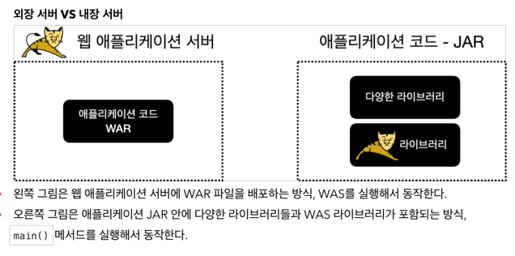

# WAR 배포 방식의 단점
- Tomcat 같은 WAS를 별도로 설치해야 한다.
- Application 코드를 WAR로 빌드해야 한다.
- 빌드한 WAR 파일을 WAS에 배포해야 한다.



# 내장 톰캣
- `org.apache.tomcat.embed:tomcat-embed-core`
  - 톰캣 내장 라이브러리

## gradle 설정

```groovy
dependencies {
    //스프링 MVC 추가
    implementation 'org.springframework:spring-webmvc:6.0.9'

    //내장 톰켓 추가
    implementation 'org.apache.tomcat.embed:tomcat-embed-core:10.1.6'
}

//일반 Jar 생성
tasks.register('buildJar', Jar) {
    manifest {
        attributes 'Main-Class': 'hello.embed.EmbedTomcatSpringMain'
    }
    with jar
}

//Fat Jar 생성
tasks.register('buildFatJar', Jar) {
    manifest {
        attributes 'Main-Class': 'hello.embed.EmbedTomcatSpringMain'
    }
    duplicatesStrategy = DuplicatesStrategy.WARN
    from { configurations.runtimeClasspath.collect { it.isDirectory() ? it : zipTree(it) } }
    with jar
}
```

## 내장 톰캣 실행
```java
public class EmbedTomcatServletMain {

    public static void main(String[] args) throws LifecycleException {
        log.info("EmbedTomcatServletMain.main");

        // Tomcat 설정
        Tomcat tomcat = new Tomcat();

        Connector connector = new Connector();
        connector.setPort(8080);
        tomcat.setConnector(connector);

        // Servlet 등록
        Context context = tomcat.addContext("", "/");
        tomcat.addServlet("", "helloServlet", new HelloServlet());
        context.addServletMappingDecoded("/hello-servlet", "helloServlet");
        tomcat.start();
    }
}
```

## 내장 톰캣 Spring 실행
```java
public class EmbedTomcatSpringMain {

    public static void main(String[] args) throws LifecycleException {
        log.info("EmbedTomcatSpringMain.main");

        // Tomcat 설정
        Tomcat tomcat = new Tomcat();
        Connector connector = new Connector();
        connector.setPort(8080);
        tomcat.setConnector(connector);

        // Spring Container 생성
        AnnotationConfigWebApplicationContext applicationContext
            = new AnnotationConfigWebApplicationContext();
        applicationContext.register(HelloConfig.class);

        // DispatcherServlet 생성, Spring Container 연결
        DispatcherServlet dispatcherServlet = new DispatcherServlet(applicationContext);

        // Servlet 등록
        Context context = tomcat.addContext("", "/");
        tomcat.addServlet("", "dispatcher", dispatcherServlet);
        context.addServletMappingDecoded("/", "dispatcher");

        tomcat.start();
    }
}
```

## FatJar 
- `./gradlew buildJar` 로 빌드할 경우
  - spring-mvc, tomcat-embed 라이브러리가 없어서 실행이 안된다.
- FatJar의 경우, 라이브러리 jar 파일을 풀어서 class 파일을 포함시킨다.

## FatJar의 단점
- 어떤 라이브러리가 포함되어 있는지 확인하기가 어렵다.
  - 모든 라이브러리가 `class`로 풀려있다.
- 파일명 중복을 해결할 수 없다.

# Spring Boot 클래스 만들기
- 내장 톰캣 실행
- 스프링 컨테이너 생성
- DispatcherServlet 등록

> 위 모든 과정을 편리하게 처리해주는 부트 클래스를 만들어 보자.

## SpringApplication
```java
public class MySpringApplication {
    
    public static void run(Class<?> configClass, String[] args) {
        // Tomcat 설정
        Tomcat tomcat = new Tomcat();
        Connector connector = new Connector();
        connector.setPort(8080);
        tomcat.setConnector(connector);

        // Spring Container 생성
        AnnotationConfigWebApplicationContext applicationContext
            = new AnnotationConfigWebApplicationContext();

        applicationContext.register(configClass);

        // DispatcherServlet 생성, Spring Container 연결
        DispatcherServlet dispatcherServlet = new DispatcherServlet(applicationContext);

        // DispatcherServlet 등록
        Context context = tomcat.addContext("", "/");
        tomcat.addServlet("", "dispatcherServlet", dispatcherServlet);
        context.addServletMappingDecoded("/", "dispatcherServlet");

        try {
            tomcat.start();
        } catch (LifecycleException e) {
            throw new RuntimeException(e);
        }
    }
}
```

## @SpringBootApplication
```java
@Target(ElementType.TYPE)
@Retention(RetentionPolicy.RUNTIME)
@Documented
@ComponentScan
public @interface MySpringBootApplication {

}
```

## ApplicationMainClass
```java
@MySpringBootApplication
public class MySpringBootAppMain {

    public static void main(String[] args) {
        MySpringApplication.run(MySpringBootAppMain.class, args);
    }
}
```
