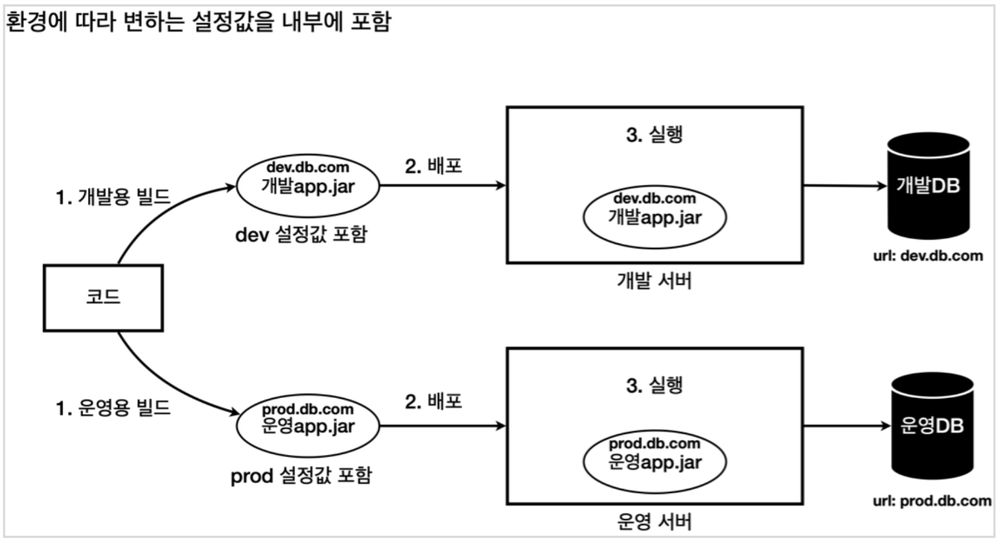
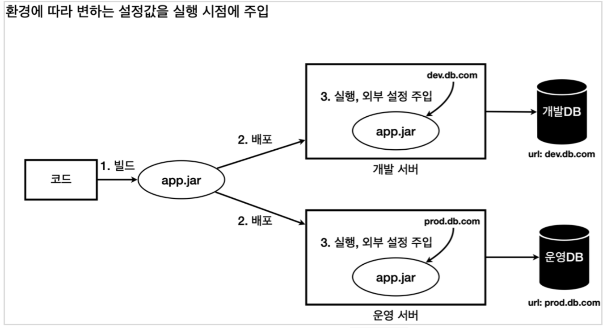
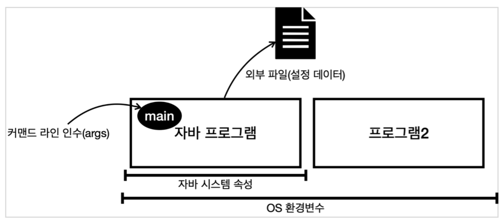
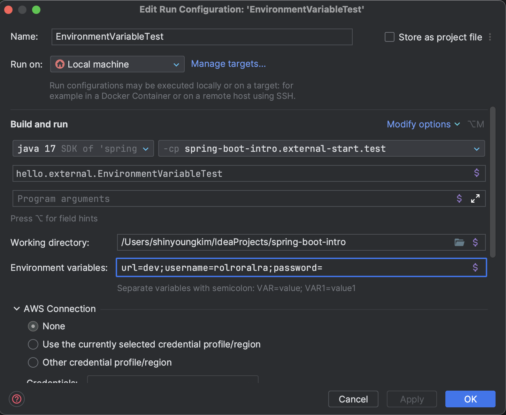
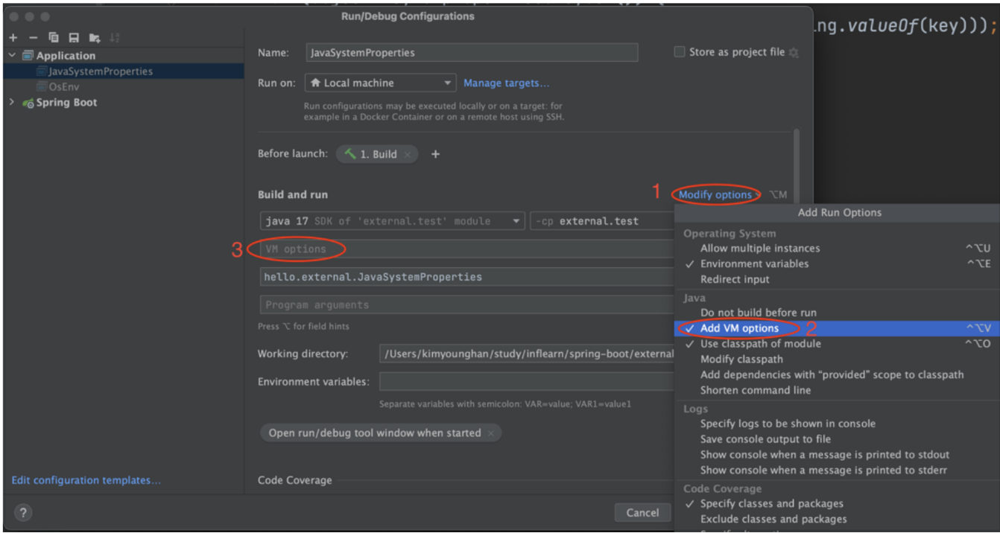
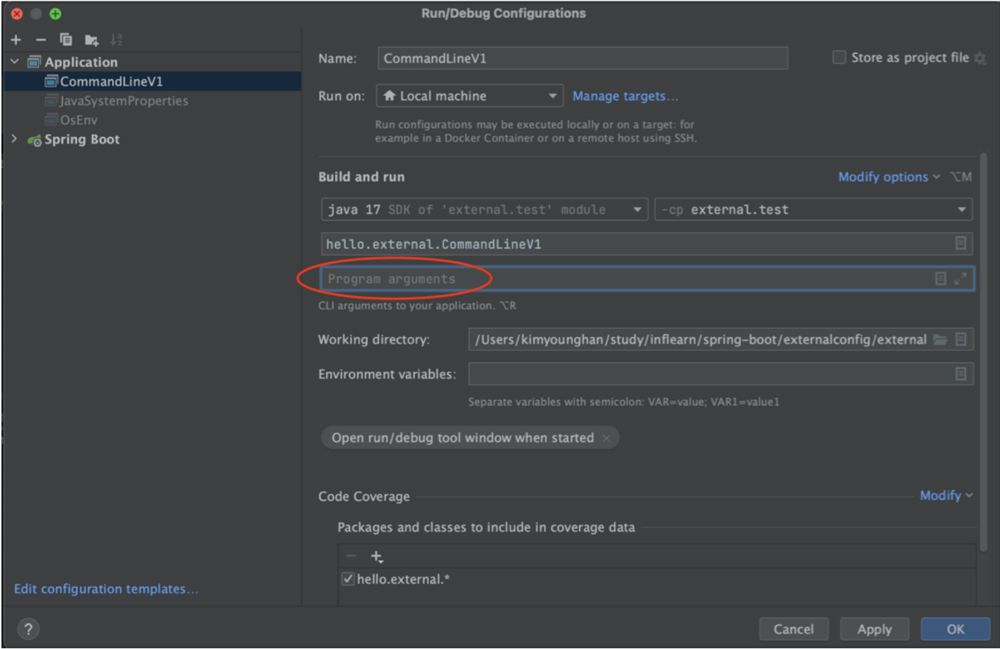
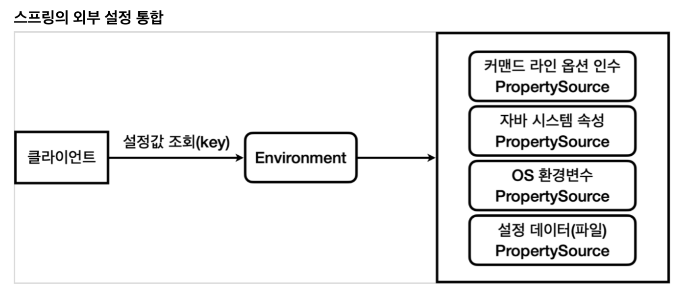
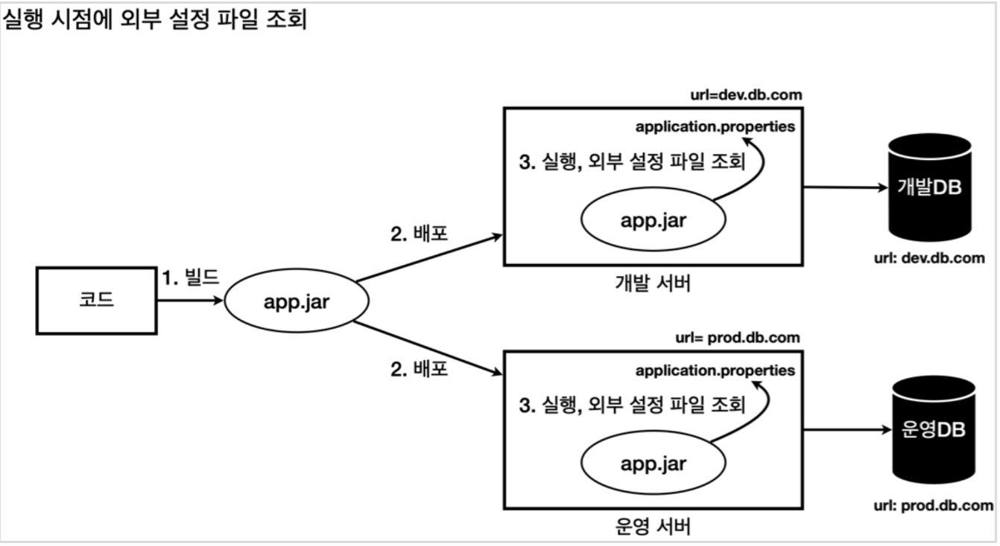
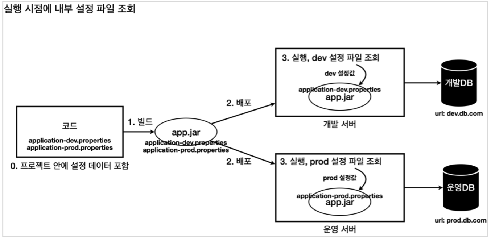
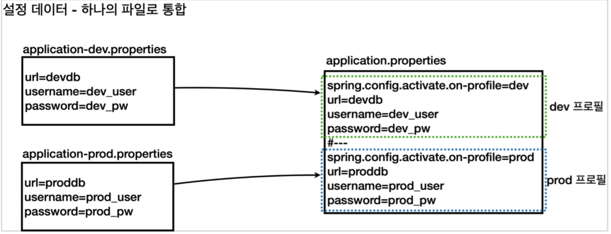

# 환경에 따라 따로 빌드


# 환경에 따라 실행 시점에 설정 주입


# Java Application 외부 설정
1. Environment Variable
2. JVM Properties
3. Java Command Line Arguments
4. application.properties



## 1. Environment Variable
- `printenv`
- `System.getenv()`
- `System.getenv("name")`

```java
@Slf4j
public class EnvironmentVariableTest {
    public static void main(String[] args) {
        Map<String, String> envMap = System.getenv();

        for (String key : envMap.keySet()) {
            log.info("Environment Variable {}={}", key, envMap.get(key));
        }
    }
}
```

### Intellij 에서 Environment Variable 추가하는 방법


## 2. JVM Properties
- 자바 시스템 속성(Java System properties)은 실행한 JVM 안에서 접근 가능한 외부 설정이다. 
  - 추가로 자바가 내부에서 미리 설정해두고 사용하는 속성들도 있다.
- `java -Dkey=value -jar application-0.0.1.jar`
  - `-Dkey=value` 

```java
public class Properties extends Hashtable<Object,Object> {
    // ...
}
```
- `System.getProperties()` : `Properties`
- `System.getProperty(String)` : `String`


- `Properties::get(Object)` : `Object`
- `Properties::getProperty(String)` : `String`
- `Properties:getOrDefuault(Object, Object)` : `Object`
- `Properties::getProperty(String, String)` : `String`

```java
@Slf4j
public class JavaPropertiesTest {
    public static void main(String[] args) {
        // Properties extends Hashtable<Object,Object> 
        Properties properties = System.getProperties();

        for (Object key : properties.keySet()) {
//            log.info("Java Property {}={}", key, properties.get(key));
            log.info("Java Property {}={}", key, System.getProperty(String.valueOf(key)));
        }
    }
}
```

### Intellij 에서 JVM Option 추가하는 방법


### jar 실행시, JVM Option 추가하는 방법
```bash
java -Durl=dev -Dusername=rolroralra -Dpassword -jar application-0.0.1.jar
```

## 3. Command Line Arguments
> Command Line Arguments는 Application 실행 시점에 외부 설정 값을 `main` 메서드의 `args` 파라미터로 전달하는 방법이다. 

- `java -jar application-0.0.1.jar url=dev username=rolroralra password=`

### Intellij 에서 Command Line Arguments 추가하는 방법


### ApplicationArguments
- 프링에서 제공하는 Command Line Arguments 옵션 인수를 규격대로 파싱해서 제공하는 인터페이스
- `DefaultApplicationArguments` : 구현체
  - `ApplicationArguments::getSourceArgs()` : `String[]`
    - 모든 Arguments 를 배열로 반환한다.
  - `ApplicationArguments::getNonOptionArgs()` : `List<String>`
    - 옵션이 아닌 인수를 List 로 반환한다. 
  - `ApplicationArguments::getOptionNames()` : `Set<String>`
    - 옵션 인수의 이름을 Set 으로 반환한다. 
  - `ApplicationArguments::getOptionValues(String)` : `List<String>`
    - 옵션 인수의 값을 List 로 반환한다. 

#### ApplicationArguments 옵션 인수 규격
- 옵션 인수
  - `--` 로 시작한다.
  - `--url=dev`
  - `--username=rolroralra`
  - `--password`
- 옵션 인수가 아닌 경우
  - `--` 로 시작하지 않는다.
  - `mode=on`

<details>
  <summary>Code Example</summary>
  <p>

```java
// --url=dev --username=rolroralra --password "hello world"
@Slf4j
public class CommandLineV2Test {
    public static void main(String[] args) {
        for (String arg : args) {
            log.info("Command Line Argument : {}", arg);
        }

        ApplicationArguments applicationArguments = new DefaultApplicationArguments(args);

        log.info("ApplicationArguments::getSourceArgs() = {}", Arrays.asList(applicationArguments.getSourceArgs()));
        log.info("ApplicationArguments::getNonOptionArgs() = {}", applicationArguments.getNonOptionArgs());
        log.info("ApplicationArguments::getOptionNames() = {}", applicationArguments.getOptionNames());

        for (String optionName : applicationArguments.getOptionNames()) {
            log.info("option args {}={}", optionName, applicationArguments.getOptionValues(optionName));
        }

        List<String> url = applicationArguments.getOptionValues("url");
        List<String> username = applicationArguments.getOptionValues("username");
        List<String> password = applicationArguments.getOptionValues("password");
        List<String> noExistsOptionValues = applicationArguments.getOptionValues("no-exists-option-name");

        log.info("url={}", url);
        log.info("username={}", username);
        log.info("password={}", password);
        log.info("noExistsOptionValues={}", noExistsOptionValues);

        assertThat(url).isNotEmpty();
        assertThat(username).isNotEmpty();
        assertThat(password).isEmpty();
        assertThat(noExistsOptionValues).isNull();
    }
}
```

  </p>
</details>

# 외부 설정 - Spring 통합
- Spring이 `Environment`, `PropertySource` 추상화를 통해 통합해서 관리한다.
  - 환경변수
  - JVM 속성
  - Command Line Arguments 
  - application.properties
- 다양한 외부 설정을 통합해서 관리한다.



## Environment
- Spring은 로딩 시점에 필요한 `PropertySource`들을 생성하고, `Enviornment`에서 사용할 수 있게 연결해둔다.
- `Environment`를 통해서 특정 외부 설정에 종속되지 않고, 일관성 있게 `key=value` 형식의 외부 설정에 접근할 수 있다.
  - `Environment::getProperty(String)` : `String`
  - 여러 설정에서 같은 값이 있을 경우, 우선순위가 존재

```java
public interface Environment extends PropertyResolver {
	String[] getActiveProfiles();

	String[] getDefaultProfiles();

	boolean acceptsProfiles(Profiles profiles);
}
```

<details>
  <summary>PropertyResolver</summary>
  <p>

```java
public interface PropertyResolver {
    
  boolean containsProperty(String key);
  
  @Nullable
  String getProperty(String key);
  
  String getProperty(String key, String defaultValue);
  
  @Nullable
  <T> T getProperty(String key, Class<T> targetType);
  
  <T> T getProperty(String key, Class<T> targetType, T defaultValue);
  
  String getRequiredProperty(String key) throws IllegalStateException;
  
  <T> T getRequiredProperty(String key, Class<T> targetType) throws IllegalStateException;

  String resolvePlaceholders(String text);

  String resolveRequiredPlaceholders(String text) throws IllegalArgumentException;
}
```

  </p>
</details>

## PropertySource<T>
- `XxxPropertySource` 구현체를 만들어 두었다.
- 구현체 목록
  - `SystemEnvironmentPropertySource` : 환경변수 기반 PropertySource 구현체
  - `JOptCommandLinePropertySource` : JVM Option 기반 PropertySource 구현체
  - `SimpleCommandLinePropertySource` : Command Line Arguments 기반 PropertySource 구현체
  - `ResourcePropertySource`
  - `ConfigurationPropertySourcesPropertySource`

```java
/**
 * @param <T> the source type
 */
public abstract class PropertySource<T> {

    @Nullable
    public abstract Object getProperty(String name);
  
    // ...
}
```

# 외부 파일 - application.properties
- Spring은 Application 로딩 시점에 `application.properties` 설정 파일을 조회한다.



- `application.properties`
  ```properties
  url=dev
  username=rolroralra
  password=
  ```

# profile
- `spring.profiles.active` : 활성화할 프로파일을 설정한다.
- profile에 해당하는 설정 파일을 조회한다.
  - `application-{profile}.properties`



## 실행 시, profile 설정 방법
- JVM 속성으로 파라미터 넘기기
  - `-Dspring.profiles.active=dev`
- Command Line Arguments 로 파라미터 넘기기
  - `--spring.profiles.active=dev` 

# profile 설정 파일 통합 
- `application.properties` 파일 하나에서 논리적으로 profile 별로 영역을 나눌수 있다.
  - `application.properties` 에서는 `#---` 혹은 `!---`
  - `application.yml` 에서는 `---`
- `spring.config.activate.on-profile` 설정 값을 통해 현재 영역에 profile 지정



```properties
spring.config.activate.on-profile=dev
url=dev
username=rolroralra
password=sa
#---
spring.config.activate.on-profile=prod
url=prod
username=root
password=root
```

## Default Profile
- Spring은 기본적으로 `default` profile을 사용한다.
  - `spring.profiles.active` 설정이 없으면 `default` profile을 사용한다.

# 외부 설정 우선순위
> 1. 더 유연한 것이 우선권을 가진다.
> 2. 범위가 넓은 것 보다 좁은 것이 우선권을 가진다.

1. `application.properties`
2. Environment Variable
3. JVM Properties
4. Command Line Arguments
5. `@TestPropertySource` (테스트 코드에서 사용)

[외부 설정에 대한 우선순위 - Spring 공식 메뉴얼](https://docs.spring.io/spring-boot/docs/current/reference/html/features.html#features.external-config)

## application.properties 우선순위
1. jar 내부 `application.properties`
2. jar 내부 `application-{profile}.properties`
3. jar 외부 `application.properties`
4. jar 외부 `application-{profile}.properties`

[설정 파일에 대한 우선순위 - Spring 공식 메뉴얼](https://docs.spring.io/spring-boot/docs/current/reference/html/features.html#features.external-config.files)
