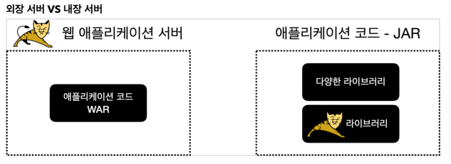
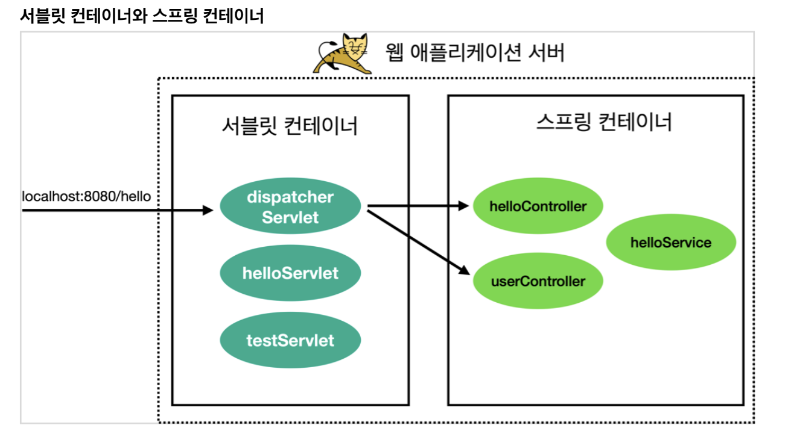
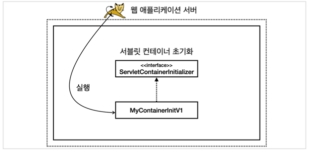
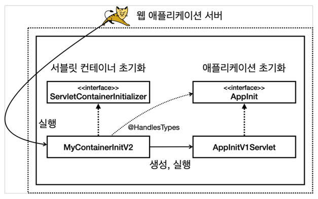
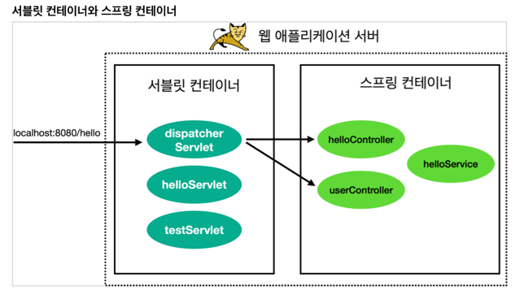
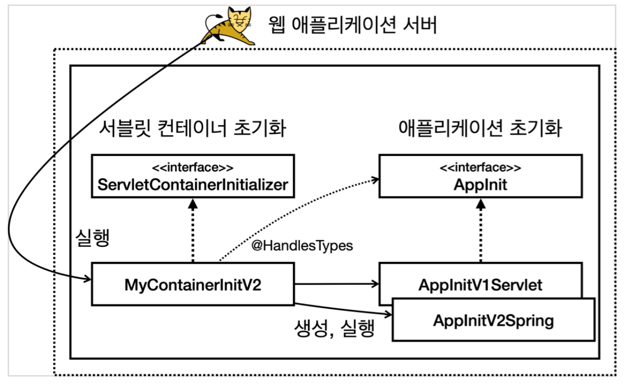
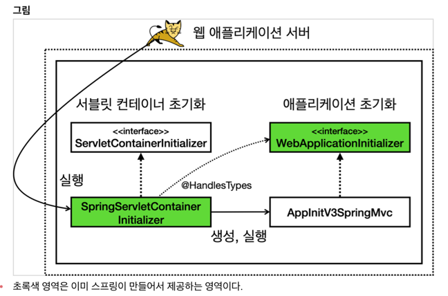

# Tomcat 설정 파일
- server.xml
```xml
<Connector port="8080" protocol="HTTP/1.1"
               connectionTimeout="20000"
               redirectPort="8443" />
```

## JAR
- Java Archive
- jar 파일은 JVM 위에서 직접 실행거나 다른 곳에서 사용하는 라이브러리로 제공된다.
- 직접 실행하는 `main()` 메서드가 필요하다.
  - `MANIFEST.MF` 파일에 `Main-Class`를 설정해야 한다.

```manifest
Manifest-Version: 1.0
Main-Class: com.example.demo.DemoApplication
```

## WAR
- Web Application Archive
- war 파일은 Web Application Server 위에서 실행된다.



### WAR 구조
- `WEB-INF`
  - `classes` : 실행 클래스 모음
  - `lib` : 라이브러리 모음
  - `web.xml` : 웹 서버 설정 파일 (생략 가능)
- 정적 리소스
  - js
  - css
  - image
  - html

# WAS 실행시 초기화 작업
1. `Servlet Container`에 `Filter`, `Servlet`을 등록한다.
2. `Spring Container`를 만들고, 관련된 `Bean`을 등록한다.
3. `Servlet Container`와 `Spring Container`를 연결하는 `DispatcherServlet`을 등록한다.



# Servlet Container 초기화 방법
1. `web.xml` 을 사용해서 초기화
2. `ServletContainerInitializer` 를 사용해서 초기화
   - `@HandlesTypes` 을 함께 사용
     - `onStartup` 첫번째 파라미터 `Set<Class<?>>` 에는 `@HandlesTypes` 어노테이션이 설정된 클래스들이 들어온다.
 
```java
public interface ServletContainerInitializer {
    void onStartup(Set<Class<?>> c, ServletContext ctx) throws ServletException;
}
```

```java
public class MyContainerInitV1 implements ServletContainerInitializer {
    @Override
    public void onStartup(Set<Class<?>> c, ServletContext ctx) throws ServletException {
        // Servlet 등록
        // Filter 등록
        // Listener 등록
        // ...
    }
}
```

### 추가적으로 WAS에게 실행할 초기화 클래스를 알려줘야 한다.
- `resources/META-INF/services/jakarta.servlet.ServletContainerInitializer` 파일을 생성한다.
```manifest
com.example.demo.servlet.MyContainerInitV2
```


# Servlet을 등록하는 2가지 방법 
1. `@WebServlet` Annotation 사용
2. 프로그래밍 방식
   - `ServletContainerInitializer`, `@HandlesTypes` 를 사용
   - `ServletContext`에 Servlet 등록

## 1. @WebServlet
- [TestServlet.java](src/main/java/hello/servlet/TestServlet.java)
```java
@WebServlet(urlPatterns = "/test")
@Slf4j
public class TestServlet extends HttpServlet {

    @Override
    protected void service(HttpServletRequest req, HttpServletResponse resp)
        throws ServletException, IOException {
        log.info("TestServlet.service");

        resp.getWriter().println("test");
    }
}
```

## 2. ServletContext에 직접 등록
- [MyContainerInitV2.java](src/main/java/hello/container/MyContainerInitV2.java)

```java
public interface AppInit {
    void onStartup(ServletContext servletContext);
}

@HandlesTypes(AppInit.class)
public class MyContainerInitV2 implements ServletContainerInitializer {
  @Override
  public void onStartup(Set<Class<?>> c, ServletContext ctx) throws ServletException {
       for (Class<?> appInitClass : c) {
           try {
               AppInit appInit = (AppInit) appInitClass.getDeclaredConstructor().newInstance();

               appInit.onStartup(ctx);
           } catch (Exception e) {
               throw new RuntimeException(e);
           }
       }
  }
}
```

```java
public class AppInitV1Servlet implements AppInit {
    @Override
    public void onStartup(ServletContext servletContext) {
        ServletRegistration.Dynamic servletRegistration 
            = servletContext.addServlet("helloServlet", new HelloServlet());

        servletRegistration.addMapping("/hello-servlet");
    }
}
```



# Spring Container

- [MyContainerInitV2.java](src/main/java/hello/container/MyContainerInitV2.java)

1. `Spring Container` 만들기
2. `Spring Container`에 `Bean` 등록하기
3. `Spring Container`와 `Servlet Container` 연결해주는 `DispatcherServlet` 등록하기


```java
public class AppInitV2Spring implements AppInit {
    @Override
    public void onStartup(ServletContext servletContext) {
        log.info("AppInitV2Spring.onStartup");

        // 1. Spring Container 생성
        AnnotationConfigWebApplicationContext applicationContext
            = new AnnotationConfigWebApplicationContext();

        applicationContext.register(HelloConfig.class);

        // 2. Spring MVC 프레임워크의 Front Controller 인 DispatcherServlet 생성, Spring Container 연결
        DispatcherServlet dispatcherServlet = new DispatcherServlet(applicationContext);

        // 3. DispatcherServlet을 Servlet Container에 등록
        servletContext
            .addServlet("dispatcherV2", dispatcherServlet)
            .addMapping("/spring/*");
    }
}
```



# Spring MVC 에서 Servlet Container 초기화 지원
- `WebApplicationInitializer` 구현하면 된다.
  - Spring 에서 해당 구현체를 찾아서, 자동으로 Servlet Container 초기화 작업을 해준다.
  
```java
public interface WebApplicationInitializer {
    void onStartup(ServletContext servletContext) throws ServletException;
}
```

## 예시
```java
public class AppInitV3SpringMvc implements WebApplicationInitializer {
    @Override
    public void onStartup(ServletContext servletContext) throws ServletException {
        // 1. Spring Container 생성
        AnnotationConfigWebApplicationContext applicationContext
            = new AnnotationConfigWebApplicationContext();

        applicationContext.register(HelloConfig.class); // @Configuration 빈 등록

        // 2. Spring MVC 프레임워크의 Front Controller 인 DispatcherServlet 생성, Spring Container 연결
        DispatcherServlet dispatcherServlet = new DispatcherServlet(applicationContext);

        // 3. DispatcherServlet을 Servlet Container에 등록
        servletContext
            .addServlet("dispatcherV3", dispatcherServlet)
            .addMapping("/springboot/*");
    }
}
```

## Spring MVC 가 제공하는 Servlet Container 초기화 분석
- `spring-web` 라이브러리에 `META-INF/services/jakarta.servlet.ServletContainerInitializer` 파일이 있다.
```manifest
org.springframework.web.SpringServletContainerInitializer
```
- `SpringServletContainerInitializer` 를 사용해서 `WebApplicationInitializer` 의 구현체를 찾아서 실행한다.

```java
@HandlesTypes(WebApplicationInitializer.class)
public class SpringServletContainerInitializer implements ServletContainerInitializer {
    @Override
    public void onStartup(@Nullable Set<Class<?>> webAppInitializerClasses, ServletContext servletContext)
        throws ServletException {
        // ...
    }
}
```


